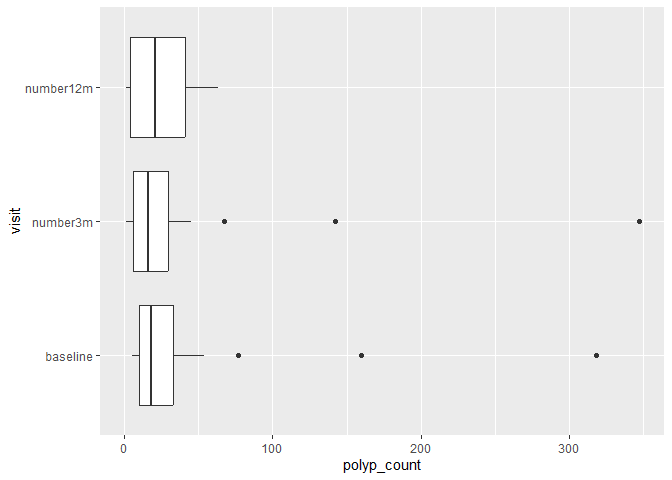

# ICA 5.2 pivoting

Attach the tidyverse and medicaldata packages here:

``` r
library(tidyverse)
library(medicaldata)
```

Task 1 - Pivot polyp counts (baseline and 12-month) longer

\(1\) Consider `medicaldata::polyps`. What is the table’s current
observational unit?

\(2\) Suppose we want to treat `baseline, number3m, and number12m` as
separate observations—in other words, all polyp counts would go into a
single column, and a new column would be added for `visit`. How many
rows would we have for each patient?

\(3\) Use `dplyr::pivot_longer()` to move the three polyp counts from
columns into rows. Your result should have `visit` and `polyp_count`
columns (`polyp_count` is where the value goes). Assign the result to a
new object. Examine the data frame and confirm that it has the expected
row count.

``` r
# 🅿
?pivot_longer
```

    starting httpd help server ... done

``` r
data(polyps)
polyps %>% 
  pivot_longer(cols=c(baseline, number3m, number12m),
               names_to="visit",
               values_to="polyp_count") %>% 
  mutate(visit = as_factor(visit)) %>% 
  ggplot() + 
  geom_boxplot(aes(x=polyp_count, y=visit))
```

    Warning: Removed 2 rows containing non-finite values (`stat_boxplot()`).


