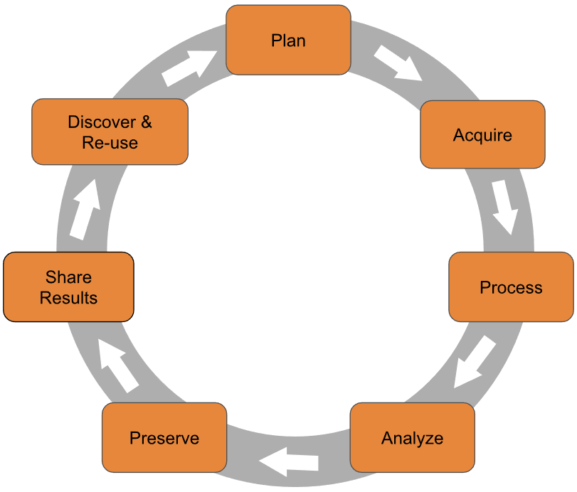

# Summer R
Dominic Bordelon, Research Data Librarian, ULS

## Agenda

1.  What are R and RStudio? What can you do with them?
2.  R as a calculator
3.  RStudio orientation
4.  Packages
5.  Loading data
6.  R data types and structures
7.  Saving data

## About the trainer

**Dominic Bordelon, Research Data Librarian**  
University Library System, University of Pittsburgh  
<dbordelon@pitt.edu>

<div class="columns">

<div class="column" width="50%">

Services for the Pitt community:

- Consultations
- Training (on-request and via public workshops)
- Talks (on-request and publicly)
- Research collaboration

</div>

<div class="column" width="50%">

Support areas and interests:

- Computer programming fundamentals, esp. for data processing and
  analysis
- Open Science and Data Sharing
- Data stewardship/curation
- Research methods; science and technology studies

</div>

</div>

## What to expect

- Review syllabus
- I strongly don’t believe in “sink or swim” or the weed-out
  mentality—reach out if you need help!
- How will we use our time?
  - Each session ~2 hours, organized thematically
  - Bit of info in slides + demonstration format
  - Practice with hands-on exercises; work in groups (recommended) or
    independently
  - We’ll do the lecture/activity cycle twice per each session, and then
    a wrap-up.

# Thinking about data

------------------------------------------------------------------------

## Thinking about data

Basic types of data:

- string or character-based data
  - may be optimized (rearranged, compressed) at the expense of
    human-readability
- image, audio, and video data

Ways to work with data:

- Tabular format
- Document format (XML)
- Computer vision and audition

In this course, we are working with string data—interpreted as numeric
values and pieces of text—in a tabular format.

# What are R and RStudio? What can you do with them?

------------------------------------------------------------------------

## What are R and RStudio?

<div class="columns">

<div class="column" width="50%">


**R** is…

- a tool for statistical analysis and visualization dating back to 1993
- a general-purpose programming language
- text-based command interface $\rightarrow$ it runs on the
  console/command line
- free, open-source software (FOSS) stewarded by the nonprofit,
  Vienna-based R Foundation

</div>

<div class="column" width="50%">


**RStudio (Desktop)** is…

- an “integrated development environment”—graphical interface with
  numerous features—for analysis and programming in R and Python
- Posit (until recently, called RStudio) is a Boston-based public
  benefit corporation, founded 2009; makes both FOSS and commercial
  software and offers hosted services

</div>

</div>

## What can you do with R and RStudio?

<div class="columns">

<div class="column" width="40%">

- Import data from file and online sources
- Explore, clean, reformat, and combine data
- Perform calculations and analyses on data, especially using
  statistical methods
- Visualize data
- Present information in a variety of formats (documents, Web, etc.)
- Build a dashboard or other web app, especially interacting with
  tabular data

</div>

<div class="column" width="60%">



</div>

</div>

## Why I prefer R

<div class="columns">

<div class="column" width="50%">

**versus Excel:**

✅ Non-proprietary, open source  
✅ Powerful and fast interactions with data  
✅ Very extensible  
✅ Research-oriented community  
✅ Reproducible and visible interactions with data  
✅ Data viz makes sense to me  
✅ Can handle more data for a given quantity of system resources  
✅ Less prone to accidental user error

❌ R has a steeper learning curve  
❌ R/RStudio doesn’t have convenient data entry

</div>

<div class="column" width="50%">

**versus Python:**

✅ Purpose-built for stats  
✅ Simpler mental model and syntax (for tabular data work)  
✅ RStudio is better than (free) IDEs for Python  
✅ I can always call Python from within R if I need to

❌ R has a smaller (but more focused) community with less published code

</div>

</div>

# R as a calculator

------------------------------------------------------------------------

## Our first R code

- When you open RStudio, you’ll see the console. This is where R waits
  for commands.
- Arithmetic operators: **`+ - * / ^`** (exponentiation) `%%` (modulus)
  `%/%` (integer division)
- As in algebra, an R **function** accepts *arguments* and returns a
  *value*.
- Common mathematical functions:
  `sum(), mean(), median(), mode(), min(), max(), sd(), sqrt(), abs()`
- Logarithms: `log(x)` for natural and `log10(x)` for base 10 (or
  `log(x, base)` for any base you want)
- $e$ (Euler’s number) is represented with `exp(1)`, where `1` is the
  desired exponent of $e$.
- Rounding: `round()` for decimal places, `signif()` for specifiying
  significant digits
  - See also: `floor()`, `ceiling()`
- NOTE: To operate on more than one value, such as calculating a mean,
  your values need to be inside a *vector*.

## Vectors in R

- An ordered collection of values, all having the same type (e.g.,
  numeric or text)
- Created with the **`c()`** function (“combine”)
- R *loves* vectors—so much, that any single value you give to R, is
  returned as a 1-length vector!
- Very many operations are *vectorized*, meaning that they apply to
  every value in a vector by default.

# RStudio orientation

------------------------------------------------------------------------

## RStudio layout (panes)

<div class="columns">

<div class="column" width="50%">

<div>

> **▟ TL: Source/Editor 📝**
>
> Write *scripts* and ***R notebooks*** in tabs

</div>

    
  

<div>

> **▜ BL: Console 👩‍💻**
>
> Run commands  
> ⬆ for command history  
> ⭾ tab key for suggestions

</div>

</div>

<div class="column" width="50%">

<div>

> **▙ TR: Environment, History 🌐**
>
> *Objects* in your *workspace* (session); Import Dataset

</div>

    
  

<div>

> **▛ BR: Help, Files, Packages ❓🔍📦**
>
> All extremely useful!

</div>

</div>

</div>

## What kinds of files will you use in RStudio? (1)

- **R Notebook** (**.Rmd**) or **Quarto document** (**.qmd**): mix
  formatted text and code and code outputs

- **R script** (**.R**): plain-text file that can be executed by R
  directly

  - ⚠ The only permitted “natural language” is in code comments.

- [**R
  Project**](https://support.rstudio.com/hc/en-us/articles/200526207-Using-RStudio-Projects)
  (**.Rproj**): lives in the directory for a given project, and holds
  information like command history and settings. Optional but
  recommended.

- .**RData**: a workspace (session) snapshot

- **.rds**: an R data structure, i.e., an R object which has been saved
  to the filesystem

## What kinds of files will you use in RStudio? (2)

Of course, you will also be loading files in whatever format your data
take (spreadsheets, shapefiles, etc.).

Protip: make sure your operating system is set to display *all* file
extensions!

- [Windows
  instructions](https://support.microsoft.com/en-us/windows/common-file-name-extensions-in-windows-da4a4430-8e76-89c5-59f7-1cdbbc75cb01)
- [macOS
  instructions](https://support.apple.com/guide/mac-help/show-or-hide-filename-extensions-on-mac-mchlp2304/mac#:~:text=On%20your%20Mac%2C%20select%20a,or%20deselect%20%E2%80%9CHide%20extension.%E2%80%9D)

## Ways to run your session

- Console: quick calculations, one-line pieces of code
- Scripts: multiple console commands saved in one file
  - You can send to console line-by-line, or entire file at once
- Notebooks: a document with “code chunks” (mini scripts)
  - You can run the chunk one line at a time, or entire chunk at once

<div>

> **Keyboard shortcuts**
>
> <div class="columns">
>
> <div class="column" width="50%">
>
> Windows:
>
> - **Ctrl-Enter** runs one line of code
> - **Ctrl-Shift-Enter** runs the whole chunk
>
> </div>
>
> <div class="column" width="50%">
>
> Mac:
>
> - **⌘-Enter** runs one line of code
> - **⌘-Shift-Enter** runs the whole chunk
>
> </div>
>
> </div>

</div>

------------------------------------------------------------------------

## Working Directory (1)

- Suppose your project folder has a subfolder called `data`, and a file
  called `patients.csv`.
  - Absolute path:
    `/users/djb190/Documents/projects/R/study-x/data/patients.csv`
  - Relative path: `data/patients.csv`
- We would rather use the relative path, but R needs to know, “relative
  to where?”

## Working Directory (2)

- Use **`getwd()`** to check your current working directory
- To set your working directory:
  - In the **Files** tab (bottom right), click the three dots **…** at
    right, find the folder you would like to use as Working Directory,
    and click Open
  - Now click the **⚙More▾** button and choose **Set As Working
    Directory**
- When you run a <u>script</u>, you should set the working directory
- When you open a <u>notebook</u>, RStudio will automatically treat the
  notebook’s location as the working directory

# Packages

------------------------------------------------------------------------

## Packages 📦

- Packages are additional functionality created by individuals and
  collaborations in the R user community
- So far, we have only used **base R**
- Packages greatly extend R! You’ll use them *all the time*.
- The authoritative place for packages is **CRAN**, the Comprehensive R
  Archive Network (<https://cran.r-project.org/>)
  - A convenient directory and repository
  - QA/QC process; trusted as reliable and safe

## Install a package

1.  Google “Rstats $x$” where $x$ is whatever you want to do (or maybe
    “R package for $x$”). Read about available packages for your job and
    choose one.
2.  Go to Packages tab (bottom right pane ▛) and click Install.
3.  Type the name of the package you want and click install.

Or if you like to write code: `install.packages("name-of-package")`

Let’s install the **tidyverse**, a collection of packages that we’ll use
for the rest of the course: **`install.packages("tidyverse")`**

## Attach a package

- To use a package, we need to *attach* it:
  - In Packages tab, click the checkbox next to the package name
  - or run `library(package-name)`
- Once a package is attached, its functions and/or datasets are
  available in the workspace. (But all packages are detached when the
  session ends.)
- Some packages will display a message or warning when they attach; some
  will not; depending on the package and your setup

Now let’s attach tidyverse: **`library(tidyverse)`**

# Loading data

------------------------------------------------------------------------

## Tabular data

You are likely to encounter tabular data in the following storage
formats:

- Comma-separated values (**CSV**) or tab-separated values (TSV):
  `.csv, .tsv, .dat, .txt`
- Excel spreadsheets: `.xlsx, .xls`
- OpenDocument spreadsheet from OpenOffice/LibreOffice: `.ods`
- Parquet, a columnar format which is very efficient: `.parquet`
- Relational databases: usually via remote connection
  - Requires writing structured query language (SQL) or using a
    SQL-based package.

We are going to focus on CSV, since it is a non-proprietary and
extremely common format.

## Loading a CSV

<div class="columns">

<div class="column" width="67%">

- readr is a package for reading CSVs and other character-delimited
  formats
  - (also possible with base R, but readr is recommended)
- `library(readr)` will attach readr, but it is included in tidyverse
  (which we already have attached)
- This means we can call readr’s `read_csv()` function!
- You can also call a function from an installed package, without
  attaching it, by prepending the package name and two colons:
  `readr::read_csv()`.

</div>

<div class="column" width="33%">


</div>

</div>

## Object assignment

In order to do something with our data, besides look at them once, we
need to tell R to *assign* the result of our expression—i.e., the output
of `read_csv()`—to an object. We also sometimes call this *storing* or
*saving* an object

We use a left-pointing arrow, **`<-`** (type less-than and hyphen) for
assignment:

``` r
my_values <- c(1, 2, 3)
```

<div>

> **Keyboard shortcuts**
>
> <div class="columns">
>
> <div class="column" width="50%">
>
> Windows:
>
> **Alt -** (alt-hyphen) inserts an assignment operator, `<-`
>
> </div>
>
> <div class="column" width="50%">
>
> Mac:
>
> **⌥ -** (option-hyphen) inserts an assignment operator, `<-`
>
> </div>
>
> </div>

</div>

You may also use **`=`** (equals) for object assignment, although it is
not recommended.

``` r
my_values = c(1, 2, 3)
```

## Viewing the data

Use the **`View()`** function on our loaded data to launch the Data
Viewer, for example: **`View(my_values)`**.

You can also type the object’s name to see a brief textual
representation of it, in the console or notebook.

# ICA 1.1: console calculations

------------------------------------------------------------------------

# R data types and structures

------------------------------------------------------------------------

## Data types

Every value in R has one of these types:

- `numeric`: real, decimal numbers
- `integer`: whole numbers
- `character`: text; should always be in quotation marks `" "` in code
- `logical`: `TRUE` and `FALSE`, also called Boolean
- `complex`: for imaginary values i.e. complex numbers (rare)
- `raw`: values are stored as bytes and not human-readable (rare)

## Data structures

Multiple values are organized into structures. These are the most common
structures:

- **Vector**: we have already used this ordered collection of single
  type; R’s default structure; 1D
- **List**: ordered collection of varying types; 1D
- **Data frame**: a tabular structure; 2D
  - “table” and “data.table” are two alternatives to data frames with
    different use cases
- Matrix (2D), Array ($n$D): Used for linear algebra (under-the-hood
  statistics)
- A special vector is the **factor**, which allows only certain values
  (defined in the structure); used for categorical variables
- Many other specialized structures are offered by packages, built upon
  these components

## The data frame

- A table in which each column (“variable”) is a vector of equal length
- Row $n$ (or “case” or “observation” $n$ ) is read by retrieving the
  $n$th value of each variable
- To reference a variable/column, use the format `data_frame$var_name`
- We’ll be spending the rest of our time in this course with data frames
  and vectors.
- (Under the hood, a data frame is a list with some added features.)

# Saving data

------------------------------------------------------------------------

## Writing a CSV

- readr can also write: **`write_csv()`**
- Remember Working Directory and relative paths.
- The file name must be in quotation marks, e.g.,
  **`write_csv("patients.csv")`**

The data frame is the “R-native” representation of the data. We read and
write to an interchange format (CSV) to save and/or share our work.

# ICA 1.2: loading and addressing data

------------------------------------------------------------------------

# Wrap up

## Conclusion

We learned about:

- Orienting to R and RStudio
- Performing basic calculations and function calls
- Opening, viewing, and saving data
- Writing our first R code 😎

Next time: exploring data frames!
