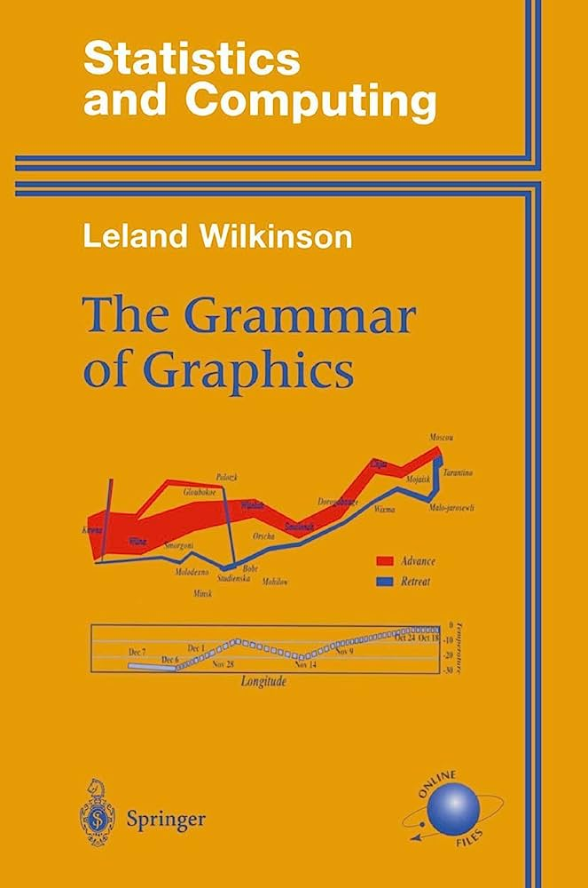

# Summer R
Dominic Bordelon, Research Data Librarian, ULS

## Agenda

1.  [R data sets](#r-data-sets)
2.  [The grammar of graphics; aesthetic
    mapping](#the-grammar-of-graphics-aesthetic-mapping)
3.  [Univariate plots](#univariate-plots)
4.  [Multivariate plots](#multivariate-plots)
5.  [Rendering notebooks](#rendering-notebooks)

## The ggplot2 package

<div class="columns">

<div class="column" width="70%">

“ggplot2 is a system for declaratively creating graphics, based on The
Grammar of Graphics (Wilkinson et al. 2005). You provide the data, tell
ggplot2 how to map variables to aesthetics, what graphical primitives to
use, and it takes care of the details.”

</div>

<div class="column" width="30%">


</div>

</div>

## ICA review, questions

## The medicaldata package

<div class="columns">

<div class="column" width="30%">

<div fig-align="center">

[](https://higgi13425.github.io/medicaldata/)

</div>

</div>

<div class="column" width="70%">

“19 medical datasets for teaching Reproducible Medical Research with R.
. . . These datasets range from reconstructed versions of James Lind’s
scurvy dataset (1757) and the original Streptomycin for Tuberculosis
trial (1948), a 2012 RCT of indomethacin to prevent post-ERCP
pancreatitis that I was involved in, to cohort data on SARS-CoV2 testing
results (2020). Many of the datasets come from the American Statistical
Association’s TSHS (Teaching Statistics in the Health Sciences)
Resources Portal. . . .”

</div>

</div>

## R data sets

- For training, exploration, practice, run `data()` to see what data
  sets you have available via attached packages
- Base R has some sets (`iris, mpg`); tidyverse comes with several
  (`storms, nycflights`)
- There are also actual data sets available—e.g., genomic annotation
  data and experimental data—as packages
- Our polyps and laryngoscope data come from medicaldata; let’s install
  and attach medicaldata now.

------------------------------------------------------------------------

``` r
install.packages("medicaldata")
library(medicaldata)

# see which data sets medicaldata offers:
data(package="medicaldata")

# load the polyps dataset into your environment:
data(polyps)

# read the help article on polyps:
?polyps
```

# The grammar of graphics; aesthetic mapping

## The grammar of graphics

<div class="columns">

<div class="column" width="50%">

- A plot is constructed in layers:
  - data
  - aesthetics (axes, encodings)
  - scale (axis labels, color coding)
  - geometric objects (bar, scatter, heatmap tiles, etc.)
  - facets
  - statistical summaries (e.g., highlighted mean; smoother)
  - annotations
  - coordinate system (Cartesian, polar, or map projection)
  - theme

</div>

<div class="column" width="50%">



</div>

</div>

## Aesthetic mapping

- “How is a variable represented visually?”
- Required for every plot
  - (which aesthetics are required, is determined by the type of plot)
- `ggplot()` and `geom_` function calls take a `mapping` argument


# Univariate plots

## Histograms: `geom_histogram()`

- x axis divided into bins; count of observations in each bin
- `binwidth` argument controls bins in data units

``` r
ggplot(laryngoscope) +
  geom_histogram(aes(x=age), binwidth = 2)
```


## Frequency polygons: `geom_freqpoly()`

- A histogram with lines drawn between bin points
- Useful for comparing across levels of a categorical variable

``` r
ggplot(laryngoscope) +
  geom_freqpoly(aes(x=age), binwidth=3)
```


## Density plots: `geom_density()`

- Smoothed version of a histogram
- Note: y axis is not count of observations but a computed density
  estimate

``` r
ggplot(laryngoscope) +
  geom_density(aes(x=age))
```


# ICA 3.1: Univariate plots

# Multivariate plots

## Scatter plots: `geom_point()`

Compare two continuous variables (x and y), looking for a relationship

``` r
ggplot(laryngoscope) +
  geom_point(aes(x=ease, y=total_intubation_time))
```


## Add a smoother: `geom_smooth()`

Regression line! (use the `method` argument to set the kind of
regression: `"lm"` for linear model, `"loess"`, etc.)

``` r
ggplot(laryngoscope, aes(x=ease, y=total_intubation_time)) +
  geom_point() +
  geom_smooth()
```

    `geom_smooth()` using method = 'loess' and formula = 'y ~ x'


## Bar charts: `geom_bar()`

- Compare counts (default) or a summary statistic (e.g., mean) among
  categories
- The easiest way to handle stats besides count is to calculate them
  yourself in the df prior to visualization, and use `stat="identity"`
- We will see how to add error bars once we know how to calculate a new
  variable in the data frame.

``` r
ggplot(polyps) + 
  geom_bar(aes(x=sex))
```


------------------------------------------------------------------------

Example bar plot with summary stats; Randomization are the treatment
groups:

``` r
laryngoscope %>%
  mutate(Randomization = as_factor(Randomization)) %>% 
  group_by(Randomization) %>% 
  summarize(mean_intubation_time = mean(total_intubation_time, na.rm=TRUE)) %>% 
  ggplot() +
  geom_bar(aes(x=Randomization, y=mean_intubation_time), stat="identity")
```


## Box plots: `geom_boxplot()`

- Quartile summary (median, 25 %ile, 75 %ile) and outliers
- Relative box widths also give a sense of distribution shape
- Outlier definition:
  $|\mathrm{median - outlier}| > 1.5 \times \mathrm{IQR}$
- Mean is often marked as an annotation

``` r
ggplot(polyps) +
  geom_boxplot(aes(y=sex, x=age))
```


## Violin plots: `geom_violin()`

Comparative histograms rotated and reflected; alternative to box plot

``` r
ggplot(polyps) +
  geom_violin(aes(x=treatment, y=number3m))
```


## Heat maps of two-way tables: `geom_tile()`

Conditional distributions, i.e., how do two categorical variables
interact?

``` r
polyps %>% 
  group_by(sex, treatment) %>% 
  summarize(n = n()) %>% 
  ggplot() + 
  geom_tile(aes(x=sex, y=treatment, fill=n))
```

    `summarise()` has grouped output by 'sex'. You can override using the `.groups`
    argument.


## Line graphs: `geom_line()` and `geom_path()`

- Show changes over time
- `geom_path()` uses data order to connect observations
- `geom_line()` uses x-axis variable to connect observations
- Use `group` aesthetic for other observation groupings, e.g.,
  per-patient
- May be combined with `geom_point()` for pronounced points (or
  “connected scatterplot”)

------------------------------------------------------------------------

``` r
covid_testing %>% 
  group_by(pan_day, result) %>% 
  summarize(n=n()) %>% 
  ggplot() +
  geom_line(aes(x=pan_day, y=n, color=result))
```

    `summarise()` has grouped output by 'pan_day'. You can override using the
    `.groups` argument.


# ICA 3.2: Multivariate plots

## Rendering notebooks

- Besides sending a notebook to a colleague, you can also **Render**
  your notebook into a variety of formats, e.g., html, word docx, pdf,
  etc.
- In the header of your notebook, take note of the `format:` heading
- Change the value of this heading and click Render in the editor
  toolbar, to render your notebook in the target format
- Multiple formats can be expressed in the same file; simply add them in
  header
- See this [Quarto Tutorial, Multiple
  Formats](https://quarto.org/docs/get-started/authoring/rstudio.html#multiple-formats)
  section for more guidance

# Wrap up

## Conclusion

We learned about:

- the “grammar of graphics” and “aesthetic mapping” concepts
- how to make several kinds of plots
- data packages
- rendering notebooks to various formats

Next time: missing data, calculating new variables, and joining tables
